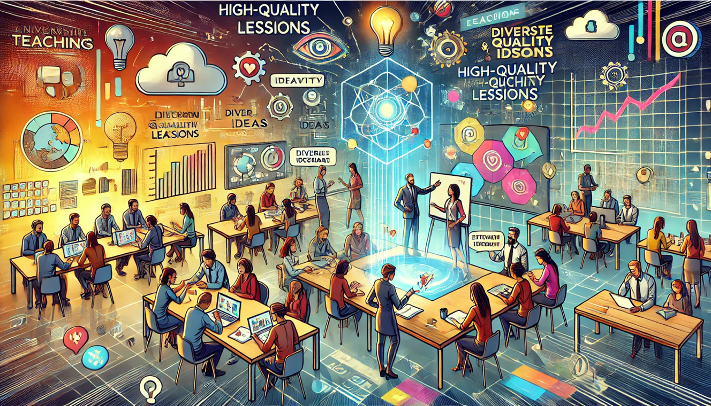



### Open Educational Resources (OER)  
#### Freie Bildungsmaterialien für alle 🌍📚🔓

#### Chancen für Lehre, Lernen und Wissenschaft  
🧑‍🏫🤝💡

**Prof. Dr. Matthias Söll**

  &copy; 2025 Prof. Dr. Matthias Söll · Universität Rostock

<!-- Konsistenter Button-Bereich unten rechts -->

  <button class="icon-button" onclick="window.print()" title="Präsentation speichern">💾</button>
  <button class="icon-button" onclick="location.href='/iWIP/oer/einfuehrung/'" title="Zur Blogansicht">📄</button>

---

## 📚 Inhaltsverzeichnis

- [Was sind OER?](#was-sind-oer)
- [Lizenzen verstehen](#lizenzen-verstehen)
- [OER finden und einsetzen](#oer-finden)
- [OER selbst erstellen](#oer-erstellen)
- [Selbst tätig werden](#selbst-taetig)
- [Quellen & weiterführende Links](#quellen)
  
---

# Was sind OER?

  

    
  

  

    
<em>OER = Open Educational Resources = freie Bildungsmaterialien</em>

  

**OER** sind frei zugängliche **Bildungsmaterialien**, die von allen **genutzt, verändert und weiterverbreitet** werden dürfen – **rechtssicher und kostenlos**.

---

# OER sind 🎓🌍🔓:
* Bildungsmaterialien in einem sehr weiten Verständnis (von einer Definition über eine Grafik bis hin zu einem Selbstlernkurse)
* frei über Online-Plattformen verfügbar (bspw. <a href="https://www.twillo.de" target="_blank" rel="noopener">twillo</a> oder <a href="https://hubbs.schule/"  target="_blank" rel="noopener">HubbS</a> geteilt)
* digital (so lässt sich das Material gut teilen)
* leicht bearbeitbar
* unter offener Lizenz veröffentlicht (siehe <a href="https://creativecommons.org" target="_blank" rel="noopener">Creative Commons</a>)

---

***Beispiele:***
- 📚 Lehrtexte, Arbeitsblätter, Präsentationen
- 🎥 Videos, 📊 Grafiken, 🎧 Audios, interaktive Lernobjekte

  Damit andere sie rechtssicher nutzen können, werden OER mit einer <strong>offenen Lizenz</strong> veröffentlicht – meist einer <strong>Creative-Commons-Lizenz (CC)</strong>.

---

***OER sind stark, weil:***

  

    
  

  

    
💡 Bildungsmaterialien in einem sehr weiten Verständnis (z. B. Konzepte oder Planungen, Texte, Zusammenfassungen oder Aufgaben, aber auch Online- oder Selbstlern-Kurse)

    
🌐 Frei über Online-Plattformen verfügbar (wie <a href="https://www.twillo.de" target="_blank" rel="noopener">twillo</a> oder <a href="https://hubbs.schule/" target="_blank" rel="noopener">HubbS</a> geteilt)

    
💻 Digital (da sich entsprechende Materialien gut teilen und bearbeiten lassen)

    
✏️ Gut bearbeitbar

    
🔓 Unter offener Lizenz veröffentlicht

  

---

# 🌍 Woher kommen OER?

📜 Ausgangspunkt der OER-Initiativen ist die 
<a href='https://www.unesco.de/assets/dokumente/Deutsche_UNESCO-Kommission/02_Publikationen/Publikation_Bildungsagenda_2030_Aktionsrahmen.pdf' target='_blank' rel='noopener'>
Agenda Bildung 2030 (PDF)
</a> der UNESCO (2015).

🎯 Ziel ist eine inklusive, chancengerechte und hochwertige Bildung für alle Menschen weltweit.

🪶 2019 veröffentlichte die UNESCO die 
<a href='https://www.unesco.de/assets/2019_Empfehlung_Open_Educational_Resources.pdf' target='_blank' rel='noopener'>
Empfehlungen zu OER (PDF)
</a>, in denen OER als Mittel zur Erreichung der Bildungsziele definiert werden.

🏛️ In Deutschland fördert das 
<strong>Bundesministerium für Forschung, Technologie und Raumfahrt (BMFTR)</strong> 
(ehem. BMBF) seit 2016 folgende Maßnahmen:

<ul style="
  font-size: 0.4em;
  margin-left: 1.2em;
  margin-top: 0.3em;
  margin-bottom: 0.3em;
  line-height: 1.3;
">
  <li>🔹 <a href='https://open-educational-resources.de/' target='_blank' rel='noopener'>OERInfo</a> (2016)</li>
  <li>🔹 <a href='https://www.oer-strategie.de/foerdern/foerderrichtlinien/' target='_blank' rel='noopener'>OE_COM</a> (2023)</li>
  <li>🔹 <a href='https://www.oer-strategie.de/foerdern/foerderrichtlinien/' target='_blank' rel='noopener'>OE_Struktur</a> (2024)</li>
</ul>

💡 Diese Maßnahmen unterstützen die Umsetzung der 
<a href='https://www.bmbf.de/SharedDocs/Publikationen/DE/3/691288_OER-Strategie.pdf?__blob=publicationFile&v=5' target='_blank' rel='noopener'>
OER-Strategie der Bundesregierung (PDF)
</a> von 2022.

 
---

# Welche Rolle nimmt OER in der Gesellschaft ein?

- **Impuls für Bildungspolitik**  
  - Das *Bündnis Freie Bildung* setzt sich für offene Lehr- und Lernmaterialien, freie Software und offene Infrastrukturen ein  
  - OER stärkt Transparenz, Teilhabe und demokratische Bildung

- **Internationale Vorreiter**  
  - **Norwegen** gilt als Vorreiter der OER-Nutzung in Schulen und Hochschulen  
  - Auch Länder wie **Polen, USA und Kanada** fördern staatlich OER-Initiativen

- **OER im Unterricht – praktische Vorteile**  
  - Schulbücher und Materialien lassen sich flexibel mit OER-Inhalten ergänzen oder aktualisieren  
  - Fördert individualisierte Lernwege und differenzierten Unterricht
  
---
- **Kultur des Teilens und Kollaborierens**  
  - OER stärkt Kooperation zwischen Lehrenden, Lernenden und Institutionen  
  - Ermöglicht gemeinschaftliche Weiterentwicklung und Verbesserung von Materialien

- **Abbau von Unsicherheiten und Wissenslücken**  
  - Aufklärung über Lizenzen (z. B. Creative Commons) ist zentral, um rechtliche Unsicherheit zu vermeiden. 
  - Lehrkräfte benötigen **Fortbildungen und klare Leitlinien**

- **Offene Wissenschaft und Wissenstransfer**  
  - Ideal für die Verbreitung von Forschungsergebnissen, Praxiswissen und Alltagswissen 
  - Unterstützt Open Science, Citizen Science und wissenschaftliche Transparenz
  - **Zwei zentrale Einschränkungen / Herausforderungen**  
  - OER bleibt häufig **Mittel zum Zweck eines strukturierten Bildungsprozesses** – nicht automatisch offen oder partizipativ („Education vs. Resource“)  
  - **Qualitätssicherung und Verlässlichkeit** von Materialien müssen gewährleistet werden
---

- **Weitere relevante Punkte**  
  - **Barrierefreiheit & Inklusion**: OER kann besser an individuelle Bedürfnisse angepasst werden.  
  - **Digitale Infrastruktur notwendig**: Plattformen, Suchportale (z. B. OERinfo), Metadaten-Standards.  
  - **Nachhaltigkeit**: Regelmäßige Pflege, Aktualisierung und langfristige Datenhaltung entscheidend.  
  - **Sprachliche und kulturelle Vielfalt**: Materialien sollten übersetzbar und global zugänglich sein.

  > Auf <a href="https://open-educational-resources.de/was-ist-oer-3-2/" target="_blank" rel="noopener">OERInfo.de</a> finden Sie weitere, anschaulich aufbereitete Informationen zu OER: bspw. ein 90s Erklärvideo, eine ausführliche Definition sowie Infos zu offenen Lizenzen und zum Mehrwert von OER.  

---

# 🔎 Noch mehr OER Infos?

  

    
<em>Auf <a href="https://open-educational-resources.de/was-ist-oer-3-2/" target="_blank" rel="noopener">OERInfo.de</a> finden Sie weitere, anschaulich aufbereitete Informationen zu OER: bspw. ein 90s Erklärvideo, eine ausführliche Definition sowie Infos zu offenen Lizenzen und zum Mehrwert von OER.</em>

  

  

    
  

---

# Warum OER? ❤️ Emotionale Begründung

  

    <blockquote class="zitat-box">
       „ Wissen ist das einzige Gut, das sich vermehrt, wenn man es teilt.“
    </blockquote>
    
Marie von Ebner-Eschenbach (1830 – 1916)

  

Ähnlich argumentiert <a href="https://www.bpb.de/shop/zeitschriften/apuz/33204/elinor-ostrom-und-die-wiederentdeckung-der-allmende/" target="_blank" rel="noopener">Elinor Ostrom</a>, erste Nobelpreisträgerin in Wirtschaftswissenschaften 2009, in <a href="https://search.worldcat.org/de/title/897400533" target="_blank" rel="noopener">„Was mehr wird, wenn wir teilen“</a>.

---

# Warum OER? 📈 Rationale Begründung

<ul>
  <li>22.638 neue Büromanagement-Azubis im Jahr 2023 👩‍💼</li>
  <li>22 Schüler:innen gehen ∅lich in eine Klasse 👥</li>
  <li>1.029 Klassen für Büromanagement-Azubis im 1. Lehrjahr 🏫</li>
  <li class="special-bullet">± 1.000 Lehrer:innen bereiten täglich ≈ Unterricht vor 👩‍🏫</li>
</ul>

  ☝️ Das Teilen und gemeinsame Bearbeiten von Bildungsmaterialien steigert die Effizienz der Vorbereitung von Lehr-Lern-Arrangements.

---

# Warum OER? ✨ Qualitative Begründung

Die Qualität von Lehr-Lern-Arrangements kann durch kooperative Entwicklung steigen.

Bildquelle: Erstellt mit ChatGPT

---
title: "Was sind OER – Präsentation"
outputs:
  - Reveal
revealOptions:
  transition: "slide"
  slideNumber: true
  controls: true
  progress: true
---



  <button onclick="triggerPrint()" title="Präsentation speichern">💾</button>
  <button onclick="location.href='/iWIP/oer/was-sind-oer'" title="Zur Blogansicht">📄</button>

---

# Was sind OER?

> OER = Open Educational Resources = freie Bildungsmaterialien  

**OER** sind frei zugängliche **Bildungsmaterialien**, die von allen **genutzt, verändert und weiterverbreitet** werden dürfen – **rechtssicher und kostenlos**.

---

* Bildungsmaterialien in einem sehr weiten Verständnis (von einer Definition über eine Grafik bis hin zu einem Selbstlernkurse)  
* frei über Online-Plattformen verfügbar (bspw. twillo oder HubbS)  
* digital (so lässt sich das Material gut teilen)  
* leicht bearbeitbar  
* unter offener Lizenz veröffentlicht (siehe Creative Commons)

---

### Beispiele

- Lehrtexte, Arbeitsblätter, Präsentationen  
- Videos, Grafiken, Audios, interaktive Lernobjekte

---

### Bedeutung von Lizenzen

Damit andere sie rechtssicher nutzen können, werden OER mit einer **offenen Lizenz** veröffentlicht – meist einer **Creative-Commons-Lizenz (CC)**.

---

# Lizenzen verstehen

Creative Commons Lizenzen ermöglichen die Nutzung von Werken unter klar definierten Bedingungen wie Namensnennung, nicht-kommerzieller Nutzung, Weitergabe unter gleichen Bedingungen und dem Verbot von Bearbeitungen. Die Lizenzangabe umfasst dabei den Lizenztyp, die Versionsnummer und optional eine Länderanpassung.

---

## CC – Bedingungen

| Kürzel | Bedeutung | Erklärung |
|--------|-----------|-----------|
| **BY** | Attribution | Der **Name des Urhebers** muss genannt werden. |
| **SA** | Share Alike | Das Werk darf **nur unter gleichen Bedingungen** weitergegeben werden. |
| **NC** | Non Commercial | **Keine kommerzielle Nutzung** erlaubt. |
| **ND** | No Derivatives | Das Werk darf **nicht verändert** werden. |

---

## Lizenzkürzel – Aufbau

**`CC BY-SA 3.0 DE`**

| Teil | Bedeutung |
|------|-----------|
| **CC** | Creative Commons |
| **BY-SA** | Lizenzbedingungen (Namensnennung + Weitergabe unter gleichen Bedingungen) |
| **3.0** | Versionsnummer |
| **DE** | Portierung für Deutschland (optional – sonst international gültig) |

---

## Beispiele in der Praxis

- **CC BY 4.0** — Namensnennung, internationale Version (weit verbreitet)  
- **CC BY-NC-ND** — Namensnennung, nicht-kommerziell, keine Bearbeitung  
- Symbole: 

---

## OER finden und einsetzen

### Wo kann man OER finden?

- HubbS - berufliche Schule  
- MUNDO - Schule  
- CC Suche  
- WirLernenOnline - Schule  
- OERSI - Hochschule

---

### Wie nutze ich OER korrekt?

Beachte bei jeder Nutzung die **TULLU-Regel** für Lizenzhinweise:

| Buchstabe | Bedeutung | Beispiel |
|------------|------------|-----------|
| **T** | Titel des Materials | „Einführung in die OER“ |
| **U** | Urheber | Max Mustermann |
| **L** | Lizenz | CC BY-SA 4.0 |
| **L** | Link zur Lizenz | https://creativecommons.org/licenses/by-sa/4.0/ |
| **U** | Ursprungsort | [Quelle oder URL]

---

## OER selbst erstellen

### Schritt 1: Lizenz auswählen
Nutze den offiziellen **CC-Lizenzgenerator**, um deine Lizenz festzulegen.  
➡️ Vorteil: Deine Lizenz ist **maschinenlesbar**, sodass dein Material besser gefunden werden kann.

---

### Schritt 2: Inhalte prüfen
Vor der Veröffentlichung:
- Stelle sicher, dass du **keine urheberrechtlich geschützten Inhalte** verwendest.  
- Falls doch: **ersetze sie durch offene Materialien** und **füge einen Lizenzhinweis hinzu**.

---

### Schritt 3: Geeignete Formate wählen
| Typ | Empfohlenes Format |
|------|--------------------|
| Textdokumente | `.docx` oder `.odt` (statt PDF, um Bearbeitung zu erleichtern) |
| Interaktive Materialien | mit **H5P** – z. B. Quizze, Selbsttests, Lernspiele |

---

### Schritt 4: Arbeitserleichterungen

**Nützliche Tools:**
- Lizenzhinweisgenerator (z. B. für Inhalte aus Wikipedia oder Wikimedia Commons)  
- CC Suche  
- Google Bilder Rückwärtssuche

---

## Zusammenfassung

OER ermöglichen:
- **Offenes, gemeinsames Lernen und Lehren**
- **Rechtssichere Nutzung und Anpassung** von Materialien
- **Transparenz und Sichtbarkeit** in der Wissenschaft und Bildung

> **Merksatz:**  
> „Offen teilen heißt gemeinsam weiterlernen – mit Respekt für Urheberrechte.“

---

## 🎯 Ziel der Aufgabe

Entwickeln Sie ein eigenes **Open Educational Resource (OER)** basierend auf einem **WiPäd-Thema Ihrer Wahl**.  
Nutzen Sie bestehende OERs als Ausgangspunkt und wandeln Sie diese in ein neues, **didaktisch sinnvolles Lehrmaterial** um.

---

## 🌟 Zielsetzung

Das Ziel ist es, ein **praxisnahes Beispiel** zu erstellen, das zeigt,  
wie aus vorhandenem OER-Material ein neues OER entstehen kann.

---

## ✅ Aufgabenstellung

### 1️⃣ Themenwahl

Wählen Sie ein Thema aus dem Bereich **Wirtschaftspädagogik**, das sich gut für die Erstellung eines didaktischen Lehrmaterials eignet.  

**Mögliche Themenbeispiele:**
- Berufliche Handlungskompetenz  
- Lernfeldunterricht  
- Kompetenzorientierung  
- Digitalisierung in der Berufsbildung  
- Nachhaltigkeit in der Berufsbildung  
- Motivation und Lernstrategien

---

### 2️⃣ Recherche von bestehenden OERs

Recherchieren Sie vorhandene **OER-Materialien**, die Sie als Ausgangsbasis nutzen können.  
Nutzen Sie z. B. folgende Plattformen:

- MUNDO  
- wirlernenonline.de  
- OERSI

---

### 3️⃣ Erstellung Ihres neuen OER-Materials

Erstellen Sie ein neues Lehrmaterial, z. B.:

- Präsentation  
- Arbeitsblatt  
- interaktives Lernmodul  
- Erklärvideo  
- Infografik

---

### 4️⃣ Lizenzierung Ihres OER

Versehen Sie Ihr Material mit einer korrekten **OER-Lizenz**, z. B. CC BY 4.0

---

### 5️⃣ Didaktische Einbindung (Dokumentation)

Beschreiben Sie die **Einbettung Ihres Materials in den Unterricht** (Zielgruppe, Kontext, Lernziele, Einsatz im Unterricht).

---

### 6️⃣ Abgabe

- **Format:** PDF oder editierbares Format (.pptx, .docx, .odt)  
- **Optional:** Bei digitalen Formaten bitte Link oder QR-Code beifügen  
- **Veröffentlichung:** Stellen Sie Ihr Material auf der Plattform/Website von Herrn Söll bereit

---

## 💡 Gestaltungshinweise

- Verwenden Sie **ausschließlich Materialien mit offenen Lizenzen**  
- Geben Sie **alle Quellen korrekt an**  
- Verwenden Sie **klare, adressatengerechte Sprache**  
- Achten Sie auf **benutzerfreundliche Struktur** und **professionelles Design**

---

## 💯 Bewertungskriterien

| Kriterium | Punkte |
|------------|:------:|
| Fachliche Richtigkeit | /20 |
| Kreativität | /20 |
| Didaktik | /20 |
| Lizenzierung | /20 |
| Gestaltung | /20 |
| **Gesamt** | **/100** |

---

## 📚 Ressourcen zur Unterstützung

- open-educational-resources.de  
- creativecommons.org/licenses

---

## 📞 Kontakt

Bei Rückfragen:  
**[Ansprechpartner:in einsetzen]**

---

## Quellen & weiterführende Links

- Creative Commons  
- OERinfo – Informationsstelle für Open Educational Resources

Bundeszentrale für politische Bildung (bpb). *Open Educational Resources – OER.*  
<https://www.bpb.de/lernen/digitale-bildung/werkstatt/222073/open-educational-resources-oer/>  
(zuletzt aufgerufen am 23. Oktober 2025)

Bundeszentrale für politische Bildung (bpb). *OER ist alles. Oder ist im Web alles OER?*  
<https://www.bpb.de/lernen/digitale-bildung/werkstatt/222108/oer-ist-alles-oder-ist-im-web-alles-oer/>  
(zuletzt aufgerufen am 27. Oktober 2025)

